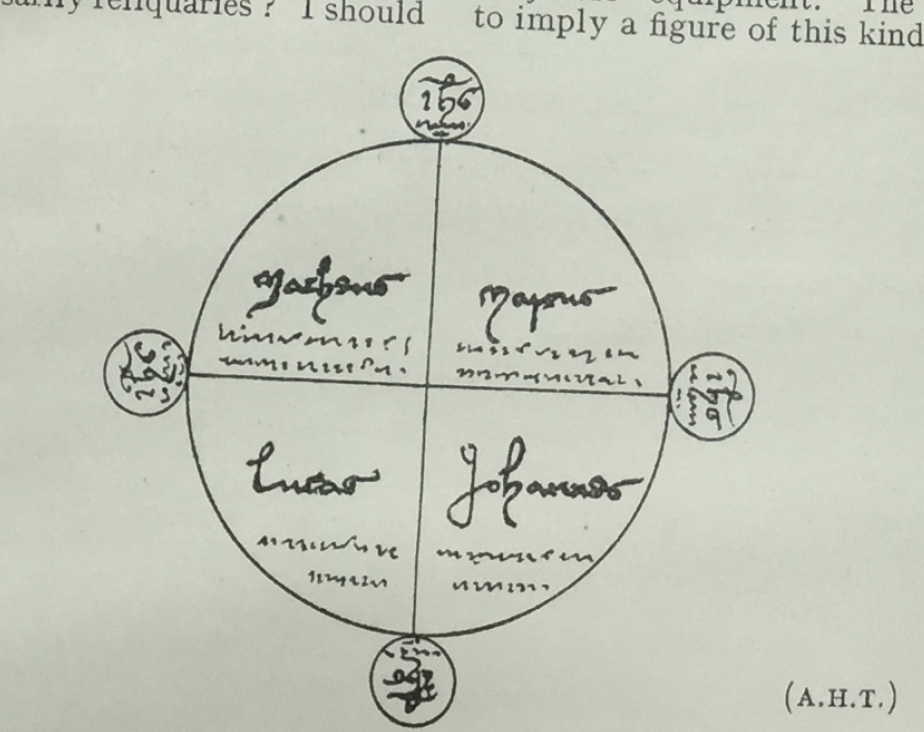

# II. Concerning a wonderful encounter between a ghost and a living man in the time of King Richard II

It is said that a certain tailor of the name of [blank] Snowball 
was returning on horseback one night from Gilling to his home in 
Ampleforth, and on the way he heard as it were the sound of ducks 
washing themselves in the beck, and soon after he saw as it were a 
raven that flew round his face and came down to the earth and 
struck the ground with its wings as though it were on the point of 
death. And the tailor got off his horse to take the raven, and as 
he did so he saw sparks of fire shooting from the sides of the raven. 
Whereupon he crossed himself and forbade him in the name of God 
to bring at that time any harm upon him. Then it flew off with 
a great screaming for about the space of a stone’s throw. Then 
again he mounted his horse and very soon the same raven met him 
as it flew, and struck him on the side and threw the tailor to the 
ground from the horse upon which he was riding ; and he lay stretched 
upon the ground as it were in a swoon and lifeless, and he was 
very frightened. 

Then, rising and strong in the faith, he fought 
with him with his sword until he was weary; and it seemed to him 
that he was striking a peat-stack; and he forbade him and conjured him in the name of God, saying, “God forbid that you have power to hurt me on this occasion, but begone.” 

And again it flew off with a horrible screaming as it were the space of the flight 
of an arrow. And the third time it appeared to the tailor as he was 
carrying the cross of his sword upon his breast for fear, and it met 
him in the likeness of a dog with a chain on its neck. And when 
he saw it the tailor, strong in the faith, thought within himself, 
"What will become of me? I will adjure him in the name of the 
Trinity and by the virtue of the blood of Christ from His five wounds 
that he speak with me, and do me no wrong, but stand fast and 
answer my questions and tell me his name and the cause of his 
punishment and the remedy that belongs to it.” And he did so. 

And the spirit, panting terribly and groaning, said, “Thus and 
thus did I, and for thus doing I have been excommunicated.[^1] Go 
therefore to a certain priest and ask him to absolve me. And it 
behoves me to have the full number of nine times twenty masses 
celebrated for me. And now of two things you must choose one. 
Hither you shall come back to me on a certain night alone bringing 
to me the answer of those whose names I have given you; and I 
will tell you how you may be made whole, and in the mean time you 
need not fear the sight of a wood fire. [^2] Or otherwise your flesh shall rot and your skin shall dry up and shall fall off from you utterly 
in a short time. Know moreover that I have met you now because 
to-day you have not heard mass nor the gospel of John (namely 
in principio), and have not seen the consecration of our Lord's body 
and blood, for otherwise I should not have had full power of appearing 
to you ." [^3] 

And as he spoke with the tailor he was as it were on 
fire and his inner parts could be seen through his mouth and he 
formed his words in his entrails and did not speak with his tongue. 
Then the tailor asked permission from the ghost that he might have 
with him on his return some companion. 

But the ghost said, "No; but have upon you the four gospels and the name of victory, namely 
Jesus of Nazareth, on account of two other ghosts that abide here 
of whom one cannot speak when he is conjured and abides in the 
likeness of fire or of a bush and the other is in the form of a hunter 
and they are very dangerous to meet. Pledge me further on this 
stone that you will defame my bones[^4] to no one except to the priests 
who celebrate on my behalf, and the others to whom you are sent on 
my behalf, who may be of use to me." 

And he gave his word upon the stone that he would not reveal the secret, as has been 
already explained. Then he conjured the ghost to go to Hodgebeck[^5] 
and to await his return. And the ghost said, “No, no, and screamed. 

And the tailor said, Go then to Byland Bank, whereat he was glad. 

The man of whom we speak was ill for some days, but then 
got well and went to York to the priest who had been mentioned, 
who had excommunicated the dead man, and asked him for absolution. But he refused to absolve him, and called to him another chaplain to take counsel with him. And that chaplain called in another, and that other a third, to advise secretly concerning the 
absolution of this man .[^6] 

And the tailor asked of him, “Sir, you know the mutual token that I hinted in your ear.” 
And he answered, Yes, my son.” 

Then after many negotiations the tailor made satisfaction and paid live shillings and received the absolution written on a piece of parchment, and he was sworn not to defame the 
dead man but to bury the absolution in his grave near his head, 
and secretly. And when he had got it he went to a certain brother 
Richard of Pickering, a confessor of repute, and asked him whether 
the absolution were sufficient and lawful. And he answered that 
it was. Then the tailor went to all the orders of the friars of York 
and he had almost all the required masses celebrated during two or 
three days, and coming home he buried the absolution in the grave 
as he had been ordered. 

And when all these things had been duly 
carried out he came home, and a certain officious neighbour of his, 
healing that he had to report to the ghost on a certain night all 
that he had done at York, adjured him, saying, “God forbid that 
you go to this ghost without telling me of your going and of the 
day and the hour.” 

And being so constrained, for fear of displeasing 
God, he told him, waking him up from sleep and saying, “I am 
going now. If you wish to come with me let us set off and I will give 
you a part of the writings that I carry on me because of night fears.” 

Then the other said, “Do you want me to go with you,” and the 
tailor said, You must see to that; I will give no advice to you.” 
Then at last the other said, “Get you gone in the name of the Lord 
and may God prosper you in all things.”[^7] 

After these words he came to the appointed place and made a great circle with a cross[^8]
and he had upon him the four gospels and other holy words and he 
stood in the middle of the circle and he placed four reliquaries in 
the form of a cross on the edge of the circle; and on the reliquaries 
were written words of salvation, namely Jesus of Nazareth, etc., 
and he waited for the coming of the ghost. He came at length in the form of a she-goat and went thrice round the circle saying, 
“Ah! ah! ah! ” And when he conjured the she-goat she fell 
prone upon the ground, and rose up again in the likeness of a man 
of great stature, horrible and thin, and like one of the dead kings 
in pictures.[^9] 

And when he was asked whether the tailor's labour 
had been of service to him, he answered, “Yes, praised be God. 
And I stood at your back when you buried my absolution in my 
grave at the ninth hour and were afraid. No wonder you were 
afraid, for three devils were present there who have tormented me 
in every way from the time when you first conjured me to the time 
of my absolution, suspecting that they would have me but very little 
time in their custody to torment me. Know therefore that on Monday next I shall pass into everlasting joy with thirty other 
spirits. Go now to a certain beck and you will find a broad stone; 
lift it up and under it you will find a sand stone. Wash your whole 
body with water and rub it with the stone and you will be whole 
in a few days."[^10] 

When he was asked the names of the two ghosts, 
he answered, "I cannot tell you their names." And when asked 
about their condition he answered that "one was a layman and a 
soldier and was not of these parts, and he killed a woman great 
with child and he will find no remedy before the day of judgment, 
and you will see him in the form of a bullock without mouth or eyes 
or ears; and however you conjure him he will not be able to 
speak. And the other was a man of religion in the shape of a hunter 
blowing upon a horn; and he will find a remedy and he will be conjured by a certain boy who has not yet come to manhood, if the Lord will.” 

And then the tailor asked the ghost of his own condition and received answer, "You are keeping wrongfully the cap and coat of one who was your friend and companion in the wars beyond 
the seas. Give satisfaction to him or you will pay dearly for it.” 

And the tailor said, " I know not where he lives ”; and the ghost 
answered, " He lives in such a town near to the castle of Alnwick.” 

When further he was asked, "What is my greatest fault ?” the ghost 
answered, " Your greatest fault is because of me.” And the man 
said, How and in what way ? ” 
And the ghost answered, " Because the people sin telling lies concerning you and bringing scandal on other dead men saying the dead man who was conjured was he or he— or he.” 

And he asked the ghost, "What shall I do? I will reveal your name?” And he said, "No; but if you stay in one place you will be rich, and in another place you will be poor, 
and you have here certain enemies .”[^11] 

Then the spirit said, " I can stay no longer talking with you.” And as they went their different 
ways, the deaf and dumb and blind bullock went with the man as 
far as the town of Ampleforth; whom he conjured in all the ways 
that he knew, but by no means could he make answer. And the 
ghost that had been aided by him advised him to keep all his best 
writings by his head until he went to sleep. " And say neither 
more nor less than I advise you and keep your eyes on the ground 
and look not on a wood fire for this night at least .”[^12] And when he 
came home he was seriously ill for several days. [^13]

[^1]: Great pains have been taken through- out to conceal the name of the ghost. He must have been a man of quality whose relatives might have objected to stories being told about him. — M.R.J.

[^2]: In the Danish tales something like this is to be found. Kristensen *Sagn og overtro* 1866, No. 585: After seeing a phantom funeral “the man was wise enough to go to the stove and look at the fire before he saw (candle- or lamp-) light. For when people see anything of the kind they are sick if they cannot get at fire before light.” Ibid., No. 371.: “He was very sick when he caught sight of the light.” The same in No. 369. In Part II of the same (1888), No. 690: “When you see anything supernatural, you should peep over the door before going into the house. You must see the light before the light sees you.” Collection of 1883, No. 193: “When he came home, he called to his wife to put out the light before he came in, but she did not and he was so sick they thought he would have died.” These examples are enough to show that there was risk attached to seeing light after a ghostly encounter. — M.R.J.

[^3]: This rather suggests that you might be reckoned to have kept a mass if you came only in time for the last gospel. — A.H.T.

[^4]: Defaming (*defamatio* or *diffamatio*) is the formal accusation of crime which renders a man liable to spiritual censure, and puts him in a state of *inf amici* from which he must free himself by compurgation or by establishing a suit against his defamer in the spiritual court. The *infamia* of a dead man (resting here on his own acknowledgment) would place him outside the privilege of Christian burial and lead to the disinterment of his remains. Cf. the posthumous defamation and disinterment of Wycliffe for heresy. - A.H.T.

[^5]: I suppose in order that the ghost might not haunt the road in the interval before the tailor’s return. — M.R.J.

[^6]: The reluctance of the priest at York to absolve and the number of advisers called in testify to the importance of the case.— M.R.J.

[^7]: The conduct of the officious neighbour who insists upon being informed of the tailor's assignation with the ghost and then backs out of accompanying him is amusing. — M.R.J.

[^8]: Whether a circle enclosing a cross or a circle drawn with a cross I do not know M.R.J. I think there can be no doubt that it was a circle with a cross drawn inside it at the points of which, where they meet the circumference, the reliquaries (*monilia*) were placed. I am not quite sure whether the passage does not mean that the names of the four gospels (i.e. the evangelists) and other sacred words were written in the quadrants of the circle. The magic circle plays a great part in a case of sorcery recorded in York Reg. Bainbridge and printed in *Archaeol. Journal*, xvi. It was here drawn on a huge sheet of parchment in a private house by an ingenious person who induced a number of people to combine with him in conjuring demons to reveal the hiding-place of a treasure at Mixendale Head, near Halifax. There is no mention of its being drawn with a cross or of a cross inscribed in it; it was copied from a conjuring book. It was inscribed however, "cum carecteribus et nominibus aliusque signis supersticiosis”; and one deponent, who arrived unexpectedly while the performance was going on, saw that the party “had a grete masse boke opyn afore theyme, and wrote oute what they wold”; cf. the “other sacred words” which the present spirit ordered his conjuror to bring with him. Are the *monilia* necessarily reliquaries? I should have thought that, in the present case, they might rather be medallions on which the *titulus triumphalis* was engraved, like the *laminae* of lead inscribed with figures of “Oberion,” “Storax,” and other spirits which formed part of the Halifax conjurors’ equipment. The text seems to imply a figure of this kind: — A.H.T.

[^9]: I think the allusion is to the pictures of the Three Living and the Three Dead so often found painted on church walls. The Dead and Living are often represented as Kings.— M.R.J. One of the best examples (though only the “Trois Vifs” remain) of this kind of painting is over the north doorway at Lutterworth, and there is a very good example at Paston, Norfolk. — A.H.T.

[^10]:The need of a prescription for healing the tailor was due to the blow in the side which the raven had given him. — M.R.J.

[^11]: This does not seem logically to follow upon the prohibition to tell the ghost’s name. I take it as advice to the tailor to change his abode. — M.R.J.

[^12]: I do not quite understand how this fire business worked; the Danish cases cited are not quite explanatory. Presumably the spirit, whom he had helped, meant that the tailor need not look at the fire as a precaution when he went home, now that all was well, and that all he need do was to keep his thoughts under control. The force of “for this night at least” seems to be that it would be well to look at the fire another night; the bullock was still about, and might be met again. — A.H.T.

[^13]: The text has been reparagraphed from the original, for better legibility in an online format -- N.B.Z
